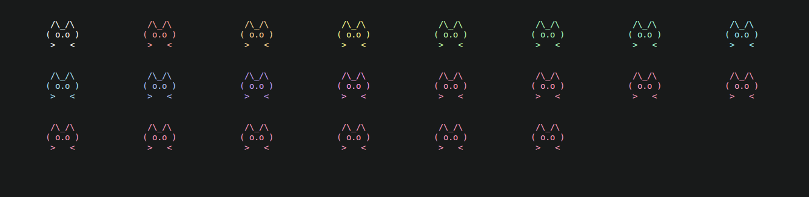
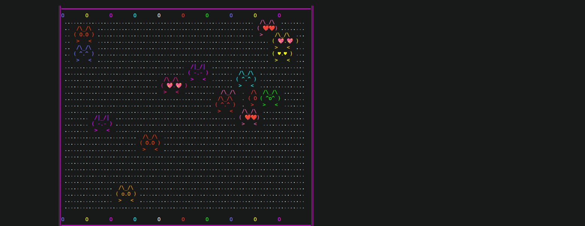

# Kittacaii v.1.1

A lightweight, header-only C++ library for rendering and animating ASCII art cats in the terminal.


## Overview

Kittacaii is a fun, dependency-free C++ library that brings animated ASCII cats to your terminal applications. It provides a simple interface for displaying cats with various expressions, colors, and animation capabilities using ANSI escape sequences.


## Features

- 🐱 **25 Pre-built Cat Expressions** - From happy to confused to loving
- 🎨 **Custom Color Support** - Color your kitties using hex color codes
- 🎬 **Sequential Animations** - Animate between different cat expressions
- 🔄 **Bulk Animation Support** - Run multiple animations concurrently
- 🖥️ **Cursor Positioning** - Place cats anywhere in the terminal
- 🚀 **Header-only Design** - Just include and go
- ⚡ **Zero Dependencies** - Uses only the C++ standard library

## Requirements

- C++11 or later
- Terminal with ANSI escape sequence support (most modern terminals)
- No external dependencies

## Installation

Since Kittacaii is header-only, simply copy the `Kittacaii` class into your project and include it:

```cpp
#include "kittacaii.cpp"  // or just paste the class directly
```

## Quick Start

```cpp
#include <iostream>
#include "kittacaii.cpp"

int main() {
    Kittacaii kitty;
    
    // Display a happy cat at position (5, 10)
    kitty.printKitty(5, 10, "happy");
    
    // Display a red angry cat at position (10, 5)
    kitty.setKittyColor("#FF0000");
    kitty.printKitty(10, 5, "angry");
    
    return 0;
}
```

## Comparison with Other Libraries

### Kittacaii vs. Other ASCII Art Libraries

| Feature | Kittacaii | figlet | cowsay | lolcat |
|---------|-----------|--------|--------|--------|
| **Cat-specific art** | ✅ 15 expressions | ❌ | ❌ | ❌ |
| **Animation support** | ✅ | ❌ | ❌ | ❌ |
| **Custom colors** | ✅ Hex support | ❌ | ❌ | ✅ |
| **Concurrent animations** | ✅ | ❌ | ❌ | ❌ |
| **Header-only** | ✅ | ❌ | ❌ | ✅ |
| **C++ native** | ✅ | ❌ | ❌ | ❌ |
| **Zero dependencies** | ✅ | ❌ | ✅ | ❌ |
| **Interactive expressions** | ✅ | ❌ | ❌ | ❌ |

### Key Advantages
- **Purpose-built for cats** - Unlike general ASCII art libraries
- **Native C++ support** - No external process spawning needed
- **Animation framework** - Built-in support for dynamic content
- **Emotional expression system** - 15 different cat moods
- **Concurrent rendering** - Multiple cats can animate simultaneously
- **Color integration** - Seamless ANSI color support

## Troubleshooting

### Common Issues

**Q: Cats appear garbled or misplaced**
- Ensure your terminal supports ANSI escape sequences
- Check that you're using 1-based coordinates (not 0-based)
- Try clearing the screen before rendering: `std::cout << "\033[2J\033[H";`

**Q: Colors not showing**
- Verify your terminal supports true color (24-bit)
- Check hex color format: must be `#RRGGBB`
- Try resetting color: `kitty.resetKittyColor();`

**Q: Animations stutter or flicker**
- Increase delay between frames
- Ensure terminal buffer is properly cleared
- Try reducing concurrent animations

## Performance Considerations

- **Rendering:** Each cat render uses minimal system resources
- **Animation:** Bulk animations are optimized for concurrent execution
- **Memory:** Each cat instance uses < 1KB of memory
- **CPU:** Typical rendering uses < 1% CPU on modern systems

## Contributing

Contributions are welcome! Here are ways you can help:

1. **Add new cat expressions** - Create new moods and poses
2. **Improve animation system** - Add easing, transitions
3. **Optimize rendering** - Reduce screen flicker
4. **Add features** - Sound effects, particle systems
5. **Documentation** - Examples, tutorials, translations

## License

This project is open source and available under the MIT License.

## Acknowledgments

Special thanks to all cat lovers and ASCII art enthusiasts who inspired this project.

---

**Made with ❤️ and 🐱**